# sshx

**English** · [简体中文](README_zh.md) · [Website](https://xiaot623.github.io/sshx/)

> Transparent SSH enhancement — add remote-to-local commands, auto port forwarding, and local domains to your SSH workflow. Zero side effects when you don't need them.

**sshx** is a drop-in wrapper around OpenSSH. Wrap it as `alias ssh=sshx` and your existing SSH workflow works exactly as before — every flag, config, and connection passes through verbatim. But when you connect to a host (or Docker container) with sshx-aware features enabled, you unlock a connection-scoped shared remote server that gives you:



- 🔄 **Reverse command bridge** — run `sshx local <cmd>` *on the remote* to execute commands on your local machine, with stdout, stderr, exit code, and stdin all propagated.
- 📁 **Bidirectional workspace mount** — direct CLI sessions can use remote tools on local files, and local tools on remote files.
- 🔌 **Automatic port forwarding** — remote local listeners (loopback `127.0.0.1` and wildcard `0.0.0.0`; e.g., a dev server on `0.0.0.0:8080` or `localhost:8080`) are automatically detected and forwarded to your local machine.
- 🌐 **Local domain binding** — access forwarded ports as `<host>.<your-user>.sshx:<port>` in your local browser, no manual `-L` flags needed.
- 🐳 **Docker container support** — target running containers by name or ID: `sshx my-container`. Command bridge support works inside containers via `docker exec`.

## Table of Contents

- [Why sshx?](#why-sshx)
- [Architecture](#architecture)
- [Features](#features)
- [Installation](#installation)
- [Quick Start](#quick-start)
- [Configuration Reference](#configuration-reference)
- [How It Works](#how-it-works)
- [Safety & Bypass](#safety--bypass)
- [Platform Support](#platform-support)
- [Project Structure](#project-structure)
- [Roadmap](#roadmap)
- [License](#license)

## Why sshx?

| Without sshx | With sshx |
|---|---|
| `ssh remote` — works normally | `ssh remote` — works normally, *plus* server starts in background |
| Need to copy a file *from* local to remote mid-session | `sshx local cat ~/file.txt` — runs on local, output streams to remote |
| Dev server on `localhost:3000` inaccessible | Open `http://debian.<your-user>.sshx:3000` in your local browser after `sshx debian` |
| Multiple terminals each need their own `-L` forwards | One shared daemon, one forward, all terminals benefit |
| Forget to set up forwarding before connecting | Ports detected and forwarded automatically |

sshx is designed to be **safe to alias**. Hosts without sshx configuration are untouched — no daemon starts, no files are created, no performance overhead.

---

## Architecture


Each user-visible session remains a normal OpenSSH connection (or a `docker exec` session for container targets). One hidden multiplexed sidecar channel carries control and optional RemoteFS traffic to a shared target-side server, while one on-demand local daemon owns DNS records and TCP forwards across active client terminals. Automatic port forwarding uses SSH `direct-tcpip`; Docker targets support shells and the command bridge but do not use automatic port scanning.

---

## Features

### 📦 Drop-in Compatibility

- `sshx [any ssh args...]` delegates to the real OpenSSH.
- All SSH flags pass through: `-F`, `-o`, `-J`, `-L`, `-R`, `-D`, `-N`, `-T`, `-V`, `-G`, `-Q`, etc.
- `~/.ssh/config` resolution is handled by OpenSSH — no reimplementation.
- Bypass with `sshx --no-wrap` or `SSHX_DISABLE=1` at any time.

### 🐳 Docker Container Target

When the target doesn't match any SSH host, sshx falls back to resolving it as a running Docker container:

- `sshx <container-name>` — opens a shell in the container via `docker exec`.
- `sshx <container-id-prefix>` — matches by container ID prefix.
- Explicit SSH targets (`user@host`, IP addresses, hostnames with dots/colons) are never treated as Docker containers.
- Command bridge support works inside containers.
- Requires `docker` CLI available on the local machine — gracefully falls back to SSH if Docker isn't found or the container isn't running.

### 🔄 Remote-to-Local Command Bridge

Run commands on your **local machine** from inside an SSH session:

```sh
# On the remote, inside an sshx-wrapped session:
sshx local cat ~/my-local-file.txt
sshx local open -a "Google Chrome" "http://localhost:3000"
sshx local pbcopy < /tmp/some-data
sshx local --timeout=30 npm test
```

- stdout, stderr, and exit codes propagate correctly.
- stdin is sent in batch mode — pipe data in and it reaches the local command.
- Commands have no implicit deadline. Put `--timeout=<duration>` immediately after the target to opt in; bare numbers mean seconds, and values such as `500ms`, `30s`, and `2m` are accepted. Timed-out commands exit with status 124.
- Policy: a configurable deny list controls which commands are blocked.

### 📁 Bidirectional Workspace Mount (opt-in, beta)

Set `features.remoteFs: true` to expose the command initiator's workspace through a read-write FUSE mount:

- A direct `sshx remote <cmd>` exports the local home (or the current directory when outside the home), mounts it on the remote Linux target, and starts the remote command in the mapped local working directory.
- A direct interactive `sshx remote` shell still starts in the remote home; `SSHX_MOUNT_ROOT` and `SSHX_WORKSPACE` point to the mounted local source tree.
- The remote home is exported lazily on the first local command. A working directory outside the remote home creates a separate lazy export for that root.
- The local command starts at the corresponding mounted working directory. Absolute command arguments are not rewritten.
- Mounts are reused for the sidecar session, so detached tools such as `open` and `code` can continue reading files after the bridge request returns.
- VS Code/Cursor Remote-SSH integration sidecars stay remote-to-local only: those application sessions do not export a local workspace to the remote host.
- With RemoteFS disabled, the command runs from the local home and receives `SSHX_REMOTE_CWD` plus `SSHX_REMOTE_FS=0`.

Mounted trees permit reads, writes, and creation, but block file/directory deletion and rename in both directions. They can include sensitive files such as shell configuration and SSH credentials, so enable `remoteFs` only for targets you trust.

Set `FS_READ_ONLY=1` on the client when starting sshx to make the session mounts read-only:

```sh
FS_READ_ONLY=1 sshx debian@orb pwd
```

The value is exported into the remote session, and later `sshx local <cmd>` mounts remain read-only.

FUSE is required on the machine receiving a mounted tree. Direct `sshx remote` sessions therefore require FUSE on the remote Linux target; `sshx local` with RemoteFS requires FUSE on the local client. A mount failure fails the invocation instead of running it from the wrong directory.

#### FUSE setup

Each machine that receives a mounted view needs a working FUSE runtime. The remote Linux target needs FUSE for direct local-to-remote workspace mounts; a macOS client needs macFUSE for remote-to-local mounts.

**Linux client/target**

Install the FUSE 3 userspace tools (the kernel normally already includes the FUSE driver):

```sh
# Debian / Ubuntu
sudo apt-get update && sudo apt-get install -y fuse3

# Fedora / RHEL-family
sudo dnf install -y fuse3

# Arch Linux
sudo pacman -S fuse3
```

Verify both the device and unmount helper:

```sh
test -r /dev/fuse && test -w /dev/fuse
command -v fusermount3 || command -v fusermount
```

If `/dev/fuse` is missing on a normal Linux host, load the kernel module with `sudo modprobe fuse`. Containers and restricted VMs must also expose `/dev/fuse` and permit FUSE mounts; installing `fuse3` alone is not sufficient. Docker targets are not supported by `remoteFs` yet.

**macOS client (current sshx backend)**

Install the latest macFUSE release from [macfuse.io](https://macfuse.io/) (recommended by the macFUSE project) or with `brew install --cask macfuse`. The current sshx implementation uses macFUSE's kernel/VFS backend.

On Apple Silicon, first-time kernel-backend setup requires:

1. Shut down, then hold the power/Touch ID button to enter macOS Recovery.
2. Open Startup Security Utility, select the system volume, and choose **Reduced Security**.
3. Enable **Allow user management of kernel extensions from identified developers**, then restart.
4. In **System Settings → Privacy & Security**, allow the macFUSE system software when prompted, then restart again.

Intel Macs do not need the Startup Security Utility change, but may still require approving macFUSE in Privacy & Security and restarting. macFUSE does not require disabling SIP or Gatekeeper.

After approval, trigger a mount once and verify that macFUSE loaded:

```sh
ls /Library/Filesystems/macfuse.fs
ls /dev/macfuse*
```

**macOS 15.4+ FSKit note:** macFUSE 5 provides a userspace FSKit backend that does not require a kernel extension, Recovery-mode security changes, or a restart. It is not transparent to the current sshx mount implementation and is not enabled yet: macFUSE requires the explicit `-o backend=fskit` option, FSKit only supports mount points below `/Volumes`, and several traditional mount options are unavailable. sshx currently creates private mounts below the runtime temporary directory and supplies VFS-oriented options. Supporting FSKit therefore requires a dedicated mount-path/options adapter, although the RemoteFS wire protocol and file-operation backend can remain unchanged.

Absolute source paths are preserved as a hierarchy below sshx's private session directory, but absolute command arguments are not rewritten. RemoteFS does not expose special files/xattrs/ACLs or support Docker targets, FUSE-T, or FSKit. It is optimized for source trees and small files rather than large-file throughput.

### 🔌 Automatic Port Detection & Forwarding

When a process on the remote starts listening on `127.0.0.1` or `0.0.0.0` (e.g., `npm run dev` on port 3000), sshx detects it and:

1. Broadcasts the port to the local daemon.
2. Assigns the SSH target its own loopback IP.
3. Exposes a TCP proxy at the target domain, e.g. `debian.<your-user>.sshx:3000`.

The URL port is the remote port. sshx does not bind `127.0.0.1:<port>`; it binds the target's private loopback IP instead, so `debian.<your-user>.sshx:8080` and `ubuntu.<your-user>.sshx:8080` can point at different hosts at the same time. Run `sshx forward` to see the active mappings.

### 🌐 Local Domains (macOS, Linux)

- A local DNS responder on `127.0.0.1:53` resolves active target names dynamically.
- Each target domain resolves to a private loopback IP; the URL port selects the remote listener.
- On macOS, `/etc/resolver/<suffix>` is configured once (with `sudo` when needed).
- All terminals on the same host share one DNS resolver and forwarding daemon.

### 🏗️ Shared Server Architecture

- Compatible runtime daemons live under `~/.sshx_server/runtimes/<RuntimeHomeID>` and serve multiple application contexts and sessions. `RuntimeHomeID` is a stable digest of `TargetID` and `RuntimeID`, keeping Unix socket paths safely below platform limits.
- Client connects through one hidden multiplexed sidecar SSH channel.
- Server manages port sniffing, forwarding state, and command bridge routing centrally.
- Clients renew local and remote leases every 5 seconds. A daemon expires a client after 15 seconds without a heartbeat.
- The on-demand local daemon and remote server keep a 10-second handoff window after their last lease, then exit.
- AppVersion is diagnostic only. Compatible clients coexist; incompatible RuntimeIDs use separate directories and daemons.
- `ClientInstallID` is stable across upgrades; `TargetID` identifies normalized OpenSSH destinations, `ContextID` identifies stable application contexts, and every live sidecar gets a fresh `SessionID`.

---

## Installation

### Run with npx (Recommended)

No installation required — npx fetches the latest binary on each run:

```sh
npx @hahahhh/sshx my-server
npx @hahahhh/sshx -p 2222 user@my-server hostname
```

For repeated use, install globally:

```sh
npm install -g @hahahhh/sshx
```

The npm wrapper auto-downloads the correct native binary for your platform from GitHub Releases.

### VS Code / Cursor Remote SSH

Install the CLI normally, then run the single integration command for each application you use:

```sh
sshx integrate install vscode
sshx integrate install cursor
```

This integration is highly experimental. The command displays a warning and asks for interactive `y/n` confirmation; pass `-y` to confirm non-interactively. It locates OpenSSH, installs paired `ssh`/`scp` shims backed by the same sshx binary, patches JSONC `remote.SSH.path`, and verifies the complete invocation chain. It is idempotent and rolls back settings and shims on failure; run it again to repair the integration after moving the sshx executable. npm-managed integrations record a management marker and are refreshed automatically by later `npm install` or `npm update` operations, so the install command does not need to be rerun manually. No restart, integration-specific configuration, or extra binary is required.

Remote-SSH remains the user-visible OpenSSH connection. Every real SSH session through an integration shim receives the same application context wrapper, while information probes remain exact passthrough. The wrapper exports a stable `SSHX_CONTEXT_ID` and context-launcher path before executing the original remote command; stdin is never inspected or buffered. Each live session owns a sidecar, and temporary ControlMaster sockets let concurrent SSH and scp calls reuse authentication without a resident integration daemon.

### Download Binary

Download the prebuilt binary directly from [GitHub Releases](https://github.com/xiaot623/sshx/releases):

```sh
# Example: macOS arm64, latest release
curl -L -o sshx https://github.com/xiaot623/sshx/releases/latest/download/sshx-darwin-arm64
chmod +x sshx
sudo mv sshx /usr/local/bin/sshx
```

Available binaries: `sshx-darwin-arm64`, `sshx-darwin-amd64`, `sshx-linux-arm64`, `sshx-linux-amd64`.

### Shell Alias (Recommended)

Add to your `~/.bashrc` or `~/.zshrc`:

```sh
alias ssh=sshx
```

The alias is safe — unmatched hosts have zero overhead and zero side effects.

---

## Quick Start

### 1. Connect normally

```sh
sshx my-server
sshx my-server uname -s
sshx -p 2222 user@my-server hostname
sshx my-server --timeout=30 npm test
```

All existing SSH options work — `-F`, `-o`, `-J`, `ProxyJump`, etc. are handled by OpenSSH.

### 1a. Connect to a Docker container

```sh
# By container name
sshx my-dev-container

# By container ID prefix
sshx 4fa8bc

# Run a command directly
sshx my-container cat /etc/os-release

# Stop a command after 30 seconds (bare numbers are seconds)
sshx my-container --timeout=30 npm test
```

sshx detects that the target isn't an SSH host and automatically uses `docker exec`. The command bridge and other features work exactly the same inside containers.

### 2. Try the command bridge

Inside your SSH session on the remote:

```sh
sshx local uname -s
# → Darwin (your local machine's OS)

# Long-running bridge commands have no implicit deadline; opt in when needed
sshx local --timeout=30 npm test
```

### 3. Start a dev server on the remote

On the remote, start a server:

```sh
python3 -m http.server 8080
```

`python3 -m http.server` binds to `0.0.0.0` by default; sshx detects it the same as a `--bind 127.0.0.1` listener. Explicit `--bind <ip>` to a non-loopback interface is not forwarded.

On your **local** machine, open:

```
http://my-server.<your-user>.sshx:8080
```

No `-L` flags, no manual forwarding. Since each target gets its own loopback IP, another target can expose its own `8080` at the same time:

```sh
sshx forward
# http://my-server.<your-user>.sshx:8080 -> my-server:8080
# http://other-server.<your-user>.sshx:8080 -> other-server:8080
```

---

## Configuration Reference

`~/.sshx/config.yaml`:

```yaml
# Strict mode: if the sshx server fails, refuse the connection instead of
# falling back to plain SSH. Default: false (graceful fallback).
strict: false

features:
  # Remote-to-local command bridge (`sshx local <cmd>` on the remote)
  commandBridge: true

  # Auto-detect remote loopback and wildcard TCP listeners and expose them via
  # <host>.<user>.sshx:<remote-port>.
  autoForward: true

  # Bidirectional workspace mounts for direct CLI sessions. Default: false.
  # VS Code/Cursor integrations remain remote-to-local only.
  # Requires FUSE on each machine receiving a mount.
  remoteFs: false

commands:
  # Commands blocked from bridge execution.
  deny: []
```

---

## How It Works

```
┌─────────────────────────────────┐     ┌─────────────────────────────────┐
│  Your Local Machine              │     │  Remote Host                    │
│                                  │     │                                 │
│  Terminal A ── SSH ─────────────┼─────┼── sshx server (shared daemon)   │
│  Terminal B ── SSH ─────────────┼─────┼──   │                          │
│  Terminal C ── SSH ─────────────┼─────┼──   ├── Port sniffing           │
│                                  │     │     ├── Port forwarding         │
│  sshx local daemon               │     │     ├── Command bridge routing  │
│    ├─ Port proxy (shared)        │     │     └── Socket-proxy endpoint  │
│    └─ DNS responder (127.0.0.1)  │     │                                 │
└─────────────────────────────────┘     └─────────────────────────────────┘
```

1. **Connection**: `sshx remote` opens a normal SSH session and starts a compatible runtime under `~/.sshx_server/runtimes/<RuntimeHomeID>`.
2. **Sidecar channel**: One hidden SSH channel multiplexes command, port, heartbeat, and optional RemoteFS traffic. ContextID routes VS Code/Cursor terminals to a healthy live session.
3. **Port sniffing**: The server reads `/proc/net/tcp*` (Linux) to detect loopback (`127.0.0.1` / `::1`) and wildcard (`0.0.0.0` / `::`) listeners.
4. **Forwarding**: Detected ports are forwarded through a single shared local daemon using `ssh -W`.
5. **Domains**: The local DNS responder maps `<target>.<suffix>` → localhost. The browser's URL port selects the local forwarded port.

When `sshx` is invoked for a **non-matching host** (no sshx config, or host not in scope), it first checks if the target resolves to a running Docker container. If neither SSH nor Docker matches, it `exec`s the real `ssh` directly — no daemon, no installation, no overhead.

---

## Safety & Bypass

- `sshx --no-wrap ...` — skip all sshx behavior and call raw `ssh`.
- `SSHX_DISABLE=1 sshx ...` — same as `--no-wrap`, useful in scripts.
- `sshx local ...` on a **client** (not inside a remote session) — errors immediately with a clear message. `local` is globally reserved.
- `remoteFs` never silently falls back to an unmounted command. A failed FUSE mount fails the invocation.
- Remote exports are anchored with Go's `os.Root`; path traversal and symlink escapes are rejected.
- Docker containers that aren't running or can't be reached are pure passthrough — sshx falls back to raw `ssh` with no side effects.
- Unmatched hosts are pure passthrough — no files created, no processes started.

---

## Platform Support

| Platform | Client | Server | Docker Client |
|---|---|---|---|
| macOS | ✅ | — | ✅ |
| Linux | ✅ | ✅ | ✅ |
| Windows | 🔜 | — | 🔜 |

- **Client**: macOS and Linux are fully supported.
- **Server**: Linux is required for the remote sshx server (uses `/proc/net/tcp*` for port detection).
- **Docker Client**: macOS and Linux — targets any running Docker container via `docker exec`.
- **remoteFs**: Linux is supported; macOS clients require macFUSE and are beta. Docker targets are not supported.

---

## Project Structure

```
sshx/
├── cmd/sshx/          # Main entry point
├── internal/
│   ├── cli/           # CLI parsing, host detection, Docker container resolution
│   ├── sshcompat/     # SSH argument compatibility
│   ├── config/        # YAML configuration
│   ├── protocol/      # Client-server wire protocol
│   ├── bridge/        # Command bridge (remote → local execution)
│   ├── remotefs/      # FS protocol, secure backend, and FUSE adapter
│   ├── ports/         # Port sniffing (/proc/net/tcp*)
│   ├── forward/       # TCP forwarding
│   ├── domain/        # DNS resolver
│   └── locald/        # Local daemon (socket, DNS, forwarding)
├── scripts/           # Integration tests
├── go.mod
├── go.sum
└── README.md
```

---

## Roadmap

- [x] **v1** — Command bridge (non-interactive), auto port forwarding, domain binding, shared server
- [ ] **v2** — Streaming stdin for command bridge, GitHub binary releases, Windows client support
- [x] **remoteFs beta** — Bidirectional direct-CLI workspace mounting, with remote-to-local-only application integrations

---

## License

MIT
