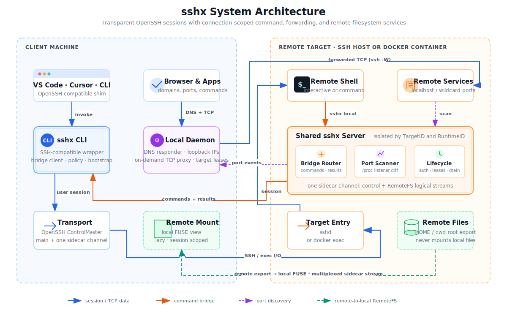

# sshx

> 透明 SSH 增强 — 为你的 SSH 工作流添加远程到本地命令执行、自动端口转发和本地域名访问。无需时零副作用。

**sshx** 是 OpenSSH 的即插即用封装器。设置 `alias ssh=sshx` 后，你现有的 SSH 工作流完全不受影响——所有参数、配置和连接都原样透传。但当连接到启用了 sshx 特性的主机（或 Docker 容器）时，你会获得一个随连接生命周期存在的共享远程服务器，提供以下能力：

- 🔄 **反向命令桥** — 在*远程*执行 `sshx local <cmd>`，命令实际在你的本地机器上运行，stdout、stderr、退出码和 stdin 全部正确传递。
- 📁 **远端到本地文件系统** — 按需开启后，让本地工具直接处理当前远端会话中的文件。
- 🔌 **自动端口转发** — 远程本地监听端口（回环 `127.0.0.1` 与通配 `0.0.0.0`；如在 `0.0.0.0:8080` 或 `localhost:8080` 上的开发服务器）被自动检测并转发到本地。
- 🌐 **本地域名绑定** — 在本地浏览器中通过 `<主机>.<用户名>.sshx:<端口>` 访问转发端口，无需手动设置 `-L` 参数。
- 🐳 **Docker 容器支持** — 通过名称或 ID 直接连接运行中的容器：`sshx my-container`。命令桥可通过 `docker exec` 在容器内工作。

## 为什么选择 sshx？

| 没有 sshx | 有 sshx |
|---|---|
| `ssh remote` — 正常工作 | `ssh remote` — 正常工作，*同时*在后台启动服务器 |
| 需要在会话中从本地复制文件到远程 | `sshx local cat ~/file.txt` — 在本地执行，输出流式传回远程 |
| `localhost:3000` 上的开发服务器无法访问 | 执行 `sshx debian` 后，在本地浏览器打开 `http://debian.<你的用户名>.sshx:3000` |
| 多个终端各自需要设置 `-L` 转发 | 一个共享守护进程，一次转发，所有终端受益 |
| 连接前忘记设置端口转发 | 端口自动检测并转发 |

sshx 设计为**可安全别名化**。未配置 sshx 的主机完全不受影响——不启动守护进程，不创建文件，零性能开销。

---

## 系统架构



每个用户可见会话仍是普通的 OpenSSH 连接；容器目标则使用 `docker exec`。一条隐藏的复用 sidecar 通道承载控制和可选 RemoteFS 流量，本地按需守护进程统一管理活跃终端使用的 DNS 记录和 TCP 转发。自动端口转发使用 SSH `direct-tcpip`；Docker 目标支持 shell 和命令桥，但不启用自动端口扫描。

---

## 特性

### 📦 即插即用兼容性

- `sshx [任意 ssh 参数...]` 委托给真正的 OpenSSH。
- 所有 SSH 参数透传：`-F`、`-o`、`-J`、`-L`、`-R`、`-D`、`-N`、`-T`、`-V`、`-G`、`-Q` 等。
- `~/.ssh/config` 解析由 OpenSSH 处理——不做重复实现。
- 随时可通过 `sshx --no-wrap` 或 `SSHX_DISABLE=1` 跳过所有 sshx 行为。

### 🐳 Docker 容器目标

当目标不匹配任何 SSH 主机时，sshx 会尝试将其解析为运行中的 Docker 容器：

- `sshx <容器名>` — 通过 `docker exec` 在容器中打开 shell。
- `sshx <容器 ID 前缀>` — 根据容器 ID 前缀匹配。
- 显式 SSH 目标（`user@host`、IP 地址、含点号或冒号的主机名）永远不会被当作 Docker 容器处理。
- 命令桥可在容器中使用。
- 需要本地安装 `docker` CLI——如果 Docker 不可用或容器未运行，则优雅回退到 SSH。

### 🔄 远程到本地命令桥

在 SSH 会话中，从远程执行**本地机器**上的命令：

```sh
# 在远程的 sshx 封装会话中：
sshx local cat ~/my-local-file.txt
sshx local open -a "Google Chrome" "http://localhost:3000"
sshx local pbcopy < /tmp/some-data
sshx local --timeout=30 npm test
```

- stdout、stderr 和退出码正确传递。
- stdin 以批量模式发送——管道输入数据会到达本地命令。
- 命令默认没有隐式截止时间。如需限制，请紧跟 target 指定 `--timeout=<时长>`；裸数字按秒解释，也支持 `500ms`、`30s`、`2m`。超时退出码为 124。
- 策略：通过可配置的拒绝列表控制哪些命令被阻止。

### 📁 远端到本地文件系统（按需开启，Beta）

设置 `features.remoteFs: true` 后，通过 `sshx local <cmd>` 启动的本地工具可以访问远端工作树：

- 第一次本地命令按需导出并挂载远端 HOME；远端 cwd 位于 HOME 外时，为对应根目录建立独立的按需导出。
- 本地命令从映射后的远端工作目录启动，但不会自动重写命令参数中的绝对路径。
- 挂载在 sidecar 会话内复用，因此 `open`、`code` 等脱离请求继续运行的工具仍可读取文件。
- 本地文件不会被导出或挂载到远端。
- RemoteFS 关闭时，本地命令从本地 HOME 启动，并获得 `SSHX_REMOTE_CWD` 和 `SSHX_REMOTE_FS=0`。

挂载后的远端目录允许读取、写入和新建，但禁止删除文件/目录及重命名。它可能包含 shell 配置、SSH 凭据等敏感文件，请只对可信 target 开启 `remoteFs`。

在 client 启动 sshx 时设置 `FS_READ_ONLY=1`，即可让该会话的挂载只读：

```sh
FS_READ_ONLY=1 sshx debian@orb pwd
```

该值会被导出到远端会话，之后执行 `sshx local <cmd>` 建立的挂载保持只读。

只有接收远端挂载的本地机器需要 FUSE。挂载失败时，当前 `sshx local` 命令会失败，不会在错误目录继续执行。Linux 需要 `/dev/fuse` 与 `fusermount`/`fusermount3`；macOS 需要当前版本的 macFUSE，现阶段标记为 Beta。

#### FUSE 环境配置

接收挂载视图的本地机器需要可用的 FUSE 环境。远端 Linux 主机通过 sshx 协议导出文件，不需要安装 FUSE。

**Linux client**

安装 FUSE 3 用户态工具（通常内核已经包含 FUSE 驱动）：

```sh
# Debian / Ubuntu
sudo apt-get update && sudo apt-get install -y fuse3

# Fedora / RHEL 系
sudo dnf install -y fuse3

# Arch Linux
sudo pacman -S fuse3
```

检查设备和卸载工具：

```sh
test -r /dev/fuse && test -w /dev/fuse
command -v fusermount3 || command -v fusermount
```

普通 Linux 主机缺少 `/dev/fuse` 时，可执行 `sudo modprobe fuse` 加载内核模块。容器和受限虚拟机还必须暴露 `/dev/fuse` 并允许 FUSE 挂载，只安装 `fuse3` 并不够。`remoteFs` 目前尚不支持 Docker target。

**macOS client（sshx 当前使用的后端）**

从 [macfuse.io](https://macfuse.io/) 安装最新版 macFUSE（macFUSE 项目推荐），也可以执行 `brew install --cask macfuse`。sshx 当前使用 macFUSE 的内核/VFS 后端。

Apple Silicon 首次启用内核后端需要：

1. 完全关机，长按电源键/Touch ID 进入 macOS 恢复模式。
2. 打开“启动安全性实用工具”，选择系统卷并设置为“降低安全性”。
3. 勾选“允许用户管理来自被认可开发者的内核扩展”，然后重启。
4. 在“系统设置 → 隐私与安全性”中允许 macFUSE 系统软件，再按提示重启。

Intel Mac 不需要修改“启动安全性实用工具”，但仍可能需要在“隐私与安全性”中允许 macFUSE 并重启。macFUSE 不要求关闭 SIP 或 Gatekeeper。

批准后先触发一次挂载，再检查 macFUSE 是否已加载：

```sh
ls /Library/Filesystems/macfuse.fs
ls /dev/macfuse*
```

**macOS 15.4+ FSKit 说明：**macFUSE 5 提供纯用户态 FSKit 后端，不需要内核扩展、恢复模式安全设置或重启，但它对 sshx 当前的挂载实现并非零改动透明，因此尚未启用。macFUSE 要求显式传入 `-o backend=fskit`；FSKit 只允许挂载到 `/Volumes` 下，并且不支持多项传统 mount option。sshx 当前在运行时临时目录下创建私有挂载点，并传入面向 VFS 的选项。支持 FSKit 需要增加专用的挂载路径和选项适配层，但 RemoteFS 线协议与文件操作后端无需改变。

来源绝对路径会作为层级保留在 sshx 的私有 session 目录下，但命令参数中的绝对路径不会被改写。RemoteFS 不暴露特殊文件、xattr/ACL，也不支持 Docker target、FUSE-T 或 FSKit。目标负载是源码树与小文件，不追求大文件吞吐。

### 🔌 自动端口检测与转发

当远程有进程在 `127.0.0.1` 或 `0.0.0.0` 上监听（如 `npm run dev` 在端口 3000），sshx 会检测到并：

1. 向本地守护进程广播该端口。
2. 为 SSH target 分配独立的 loopback IP。
3. 在目标域名上暴露 TCP 反代，例如 `debian.<用户名>.sshx:3000`。

URL 中的端口就是远程端口。sshx 不再绑定本机 `127.0.0.1:<port>`，而是绑定该 target 专属的 loopback IP，因此 `debian.<用户名>.sshx:8080` 和 `ubuntu.<用户名>.sshx:8080` 可以同时指向不同主机。可通过 `sshx forward` 查看当前映射。

### 🌐 本地域名访问（macOS、Linux）

- 本地 DNS 应答器在 `127.0.0.1:53` 动态解析活跃 target 域名。
- 每个 target 域名解析到专属的 loopback IP；URL 里的端口选择远程监听端口。
- macOS 上，`/etc/resolver/<suffix>` 仅配置一次（需要时通过 `sudo` 授权）。
- 同一主机上的所有终端共享一个 DNS 应答器和转发守护进程。

### 🏗️ 共享服务器架构

- 兼容 runtime 位于 `~/.sshx_server/runtimes/<RuntimeHomeID>`，可服务多个应用 Context 和 session。`RuntimeHomeID` 是 `TargetID` 与 `RuntimeID` 的稳定摘要，避免 Unix socket 路径超过平台限制。
- 客户端通过一条隐藏的复用 sidecar SSH 通道连接。
- 服务器集中管理端口嗅探、转发状态和命令桥路由。
- 客户端每 5 秒续租本地和远端 lease；daemon 连续 15 秒未收到心跳就清理该客户端。
- 本地按需 daemon 与远端服务器在最后一个 lease 关闭后保留 10 秒交接窗口，随后退出。
- AppVersion 只用于诊断；兼容版本共存，不兼容 RuntimeID 使用独立目录和 daemon。
- `ClientInstallID` 升级稳定；`TargetID` 标识 OpenSSH 规范化目标，`ContextID` 标识稳定应用上下文，每条活动 sidecar 使用新的 `SessionID`。

---

## 安装

### 通过 npx 运行（推荐）

无需安装——npx 每次运行时自动获取最新二进制文件：

```sh
npx @hahahhh/sshx my-server
npx @hahahhh/sshx -p 2222 user@my-server hostname
```

如果需要频繁使用，也可以全局安装：

```sh
npm install -g @hahahhh/sshx
```

npm 封装器会自动从 GitHub Releases 下载适合你平台的本地二进制文件。

### VS Code / Cursor Remote SSH

正常安装 CLI 后，对使用的应用各执行一次：

```sh
sshx integrate install vscode
sshx integrate install cursor
```

命令会自动定位 OpenSSH、创建由同一个 sshx 二进制提供的 `ssh`/`scp` shim、以 JSONC 方式修改 `remote.SSH.path`，并验证完整调用链。命令幂等，失败时回滚设置和 shim；移动 sshx 可执行文件后再次运行即可修复。无需重启应用，也不增加 integration 配置或额外发布产物。

Remote-SSH 的用户可见连接仍由原版 OpenSSH 建立。sshx 临时创建 ControlMaster，使 bootstrap、sidecar、转发和 scp 复用同一次认证。应用集成终端只注入稳定的 `SSHX_CONTEXT_ID` 和 context launcher 路径。探测、未知和歧义调用精确透传；协议不兼容或 sidecar 启动失败时发送原始 bootstrap 字节，并且无论 `strict` 如何设置都保持 OpenSSH 的正常行为。

### 下载二进制文件

直接从 [GitHub Releases](https://github.com/xiaot623/sshx/releases) 下载预编译二进制文件：

```sh
# 示例：macOS arm64，最新版本
curl -L -o sshx https://github.com/xiaot623/sshx/releases/latest/download/sshx-darwin-arm64
chmod +x sshx
sudo mv sshx /usr/local/bin/sshx
```

可用二进制文件：`sshx-darwin-arm64`、`sshx-darwin-amd64`、`sshx-linux-arm64`、`sshx-linux-amd64`。

### Shell 别名（推荐）

添加到 `~/.bashrc` 或 `~/.zshrc`：

```sh
alias ssh=sshx
```

别名是安全的——不匹配的主机零开销、零副作用。

---

## 快速开始

### 1. 正常连接

```sh
sshx my-server
sshx my-server uname -s
sshx -p 2222 user@my-server hostname
sshx my-server --timeout=30 npm test
```

所有已有的 SSH 选项均可使用——`-F`、`-o`、`-J`、`ProxyJump` 等由 OpenSSH 处理。

### 1a. 连接到 Docker 容器

```sh
# 通过容器名
sshx my-dev-container

# 通过容器 ID 前缀
sshx 4fa8bc

# 直接执行命令
sshx my-container cat /etc/os-release

# 30 秒后停止命令（裸数字按秒解释）
sshx my-container --timeout=30 npm test
```

sshx 检测到目标不是 SSH 主机后自动使用 `docker exec`。命令桥等功能在容器中完全一致地工作。

### 2. 尝试命令桥

在远程的 SSH 会话中：

```sh
sshx local uname -s
# → Darwin（你本地机器的操作系统）

# 长时间桥接命令默认没有截止时间；需要时显式指定
sshx local --timeout=30 npm test
```

### 3. 在远程启动开发服务器

在远程启动一个服务器：

```sh
python3 -m http.server 8080
```

`python3 -m http.server` 默认绑定 `0.0.0.0`，sshx 会像对待 `--bind 127.0.0.1` 一样检测到它。显式 `--bind <ip>` 到非回环接口不会被转发。

在**本地**机器上打开：

```
http://my-server.<你的用户名>.sshx:8080
```

无需 `-L` 参数，无需手动转发。由于每个 target 都有专属 loopback IP，另一个 target 也可以同时暴露自己的 `8080`：

```sh
sshx forward
# http://my-server.<你的用户名>.sshx:8080 -> my-server:8080
# http://other-server.<你的用户名>.sshx:8080 -> other-server:8080
```

---

## 配置参考

`~/.sshx/config.yaml`：

```yaml
# 严格模式：如果 sshx 服务器失败，拒绝连接而不是回退到普通 SSH。
# 默认：false（优雅回退）。
strict: false

features:
  # 远程到本地命令桥（在远程执行 sshx local <cmd>）
  commandBridge: true

  # 自动检测远程回环和通配 TCP 监听端口，并通过
  # <host>.<user>.sshx:<远程端口> 暴露。
  autoForward: true

  # 为本地命令按需挂载远端文件。默认：false。
  # 只有本地机器需要 FUSE。
  remoteFs: false

commands:
  # 阻止通过命令桥执行的命令列表。
  deny: []
```

---

## 工作原理

```
┌─────────────────────────────────┐     ┌─────────────────────────────────┐
│  你的本地机器                     │     │  远程主机                        │
│                                  │     │                                 │
│  终端 A ── SSH ─────────────────┼─────┼── sshx 服务器（共享守护进程）     │
│  终端 B ── SSH ─────────────────┼─────┼──   │                          │
│  终端 C ── SSH ─────────────────┼─────┼──   ├── 端口嗅探                 │
│                                  │     │     ├── 端口转发                 │
│  sshx 本地守护进程                │     │     ├── 命令桥路由               │
│    ├─ 端口代理（共享）            │     │     └── Socket-proxy 端点       │
│    └─ DNS 应答器 (127.0.0.1)    │     │                                 │
└─────────────────────────────────┘     └─────────────────────────────────┘
```

1. **连接**：`sshx remote` 打开正常 SSH 会话，并在 `~/.sshx_server/runtimes/<RuntimeHomeID>` 下启动兼容 runtime。
2. **Sidecar 通道**：一条隐藏 SSH 通道复用命令、端口、心跳和可选 RemoteFS 流量；ContextID 将 VS Code/Cursor 终端路由到健康活动 session。
3. **端口嗅探**：服务器读取 `/proc/net/tcp*`（Linux）来检测回环（`127.0.0.1` / `::1`）和通配（`0.0.0.0` / `::`）监听端口。
4. **转发**：检测到的端口通过单个共享本地守护进程使用 `ssh -W` 转发。
5. **域名**：本地 DNS 应答器将 `<target>.<suffix>` 映射到 localhost。浏览器 URL 中的端口选择对应的本地转发端口。

当 `sshx` 用于**不匹配的主机**时（无 sshx 配置或主机不在范围内），会先检查目标是否可解析为运行中的 Docker 容器。如果 SSH 和 Docker 都不匹配，则直接 `exec` 真正的 `ssh`——无守护进程，无安装，无开销。

---

## 安全与绕过

- `sshx --no-wrap ...` — 跳过所有 sshx 行为，直接调用原始 `ssh`。
- `SSHX_DISABLE=1 sshx ...` — 与 `--no-wrap` 相同，适用于脚本场景。
- 在**客户端**上执行 `sshx local ...`（非远程会话中）— 立即报错并给出清晰提示。`local` 是全局保留名称。
- `remoteFs` 不会静默回退到未挂载的命令；FUSE 挂载失败即失败。
- 远端导出使用 Go `os.Root` 锚定，拒绝路径穿越和符号链接逃逸。
- Docker 容器未运行或不可达时纯透传——sshx 回退到原始 `ssh`，无副作用。
- 不匹配的主机纯透传——不创建文件，不启动进程。

---

## 平台支持

| 平台 | 客户端 | 服务器 | Docker 客户端 |
|---|---|---|---|
| macOS | ✅ | — | ✅ |
| Linux | ✅ | ✅ | ✅ |
| Windows | 🔜 | — | 🔜 |

- **客户端**：macOS 和 Linux 完全支持。
- **服务器**：远程 sshx 服务器需要 Linux（使用 `/proc/net/tcp*` 进行端口检测）。
- **Docker 客户端**：macOS 和 Linux——通过 `docker exec` 连接任意运行中的 Docker 容器。
- **remoteFs**：Linux 已支持；macOS 客户端依赖 macFUSE，当前为 Beta；不支持 Docker target。

---

## 项目结构

```
sshx/
├── cmd/sshx/          # 主入口
├── internal/
│   ├── cli/           # CLI 解析、主机检测、Docker 容器解析
│   ├── sshcompat/     # SSH 参数兼容
│   ├── config/        # YAML 配置
│   ├── protocol/      # 客户端-服务器通信协议
│   ├── bridge/        # 命令桥（远程 → 本地执行）
│   ├── remotefs/      # FS 协议、安全后端与 FUSE adapter
│   ├── ports/         # 端口嗅探（/proc/net/tcp*）
│   ├── forward/       # TCP 转发
│   ├── domain/        # DNS 解析器
│   └── locald/        # 本地守护进程（socket、DNS、转发）
├── scripts/           # 集成测试
├── go.mod
├── go.sum
└── README.md
```

---

## 路线图

- [x] **v1** — 命令桥（非交互式）、自动端口转发、域名绑定、共享服务器
- [ ] **v2** — 命令桥流式 stdin、GitHub 二进制发布、Windows 客户端支持
- [x] **remoteFs Beta** — Linux/macOS 客户端按需挂载远端工作区

---

## 许可证

MIT
