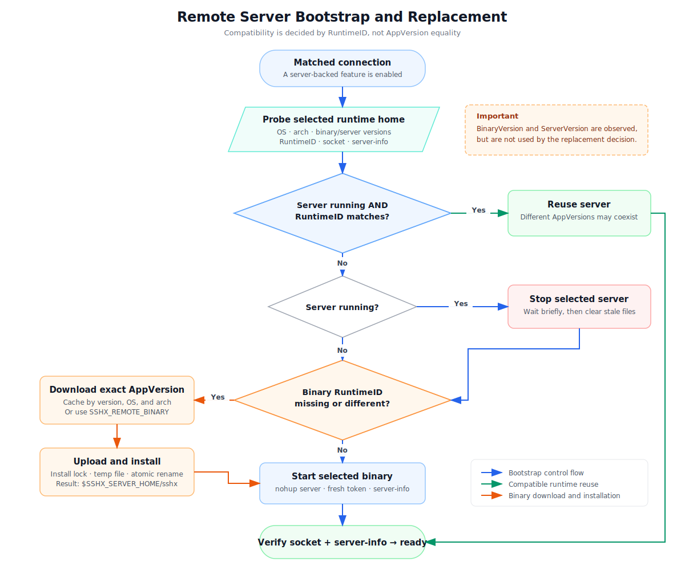

# Remote Server Bootstrap, Updates, and Protocol Identities

This document describes the current sshx remote-server bootstrap and replacement
policy, the identities carried by sshx protocols, and the rules for changing
those identities. It documents the implementation as of `0.0.6-rc.1`.

The central design rule is:

> sshx reuses a remote server by runtime compatibility, not by application
> version equality.

Consequently, a `0.0.6-rc.1` client may intentionally use a running
`0.0.6-rc.0` remote server when both binaries report the same `RuntimeID`.
`AppVersion` is diagnostic metadata and does not, by itself, trigger remote
binary replacement.

## Remote bootstrap flow



The source image is available as both
[SVG](./assets/server-bootstrap-flow.svg) and
[PNG](./assets/server-bootstrap-flow.png).

The implementation is centered in
[`internal/cli/bootstrap.go`](../internal/cli/bootstrap.go). For a matched SSH
or Docker target with an enabled server-backed feature, the client performs the
following steps before opening the user session:

1. Compute the remote runtime home from `TargetID` and `RuntimeID`.
2. Probe the selected remote runtime home for:
   - operating system;
   - architecture;
   - installed binary version;
   - running server version from `server-info`;
   - installed binary `RuntimeID`;
   - socket and `server-info` presence.
3. Reuse a running server immediately when its `RuntimeID` matches the client.
4. Otherwise, stop a server found in that runtime home.
5. Download and install a binary only when the installed binary's `RuntimeID`
   is missing or differs from the client's `RuntimeID`.
6. Start the selected binary and verify that both the Unix socket and
   `server-info` appear.

### Current decision table

| Running server | Installed binary `RuntimeID` | Result |
| --- | --- | --- |
| Yes | Matches client | Reuse immediately. Binary and server application versions are ignored. |
| Yes | Missing or different | Stop it, install the client's release binary, start, and verify. |
| No | Matches client | Start the already installed binary, even if its application version is older. |
| No | Missing or different | Install the client's release binary, start, and verify. |

The probe reads `BinaryVersion` and `ServerVersion`, but
`ensureBootstrappedServer` currently does not use either value in its decision.
This is deliberate compatibility-based reuse, not semantic-version comparison.

### Runtime directory selection

The remote server home is:

```text
~/.sshx_server/runtimes/<RuntimeHomeID>
```

`RuntimeHomeID` is a truncated SHA-256 digest of `TargetID` and `RuntimeID`.
This gives each normalized target and incompatible runtime generation a separate
directory while keeping Unix socket paths below platform limits.

Changing `RuntimeID` therefore normally selects a new, empty runtime directory.
The new server can be installed alongside the old generation; the old daemon
exits after its sessions drain. If a mismatched daemon is found inside the
selected directory, bootstrap stops it before replacement.

### Download, cache, and installation

For release builds, the client downloads the exact application version it is
running:

```text
https://github.com/xiaot623/sshx/releases/download/v<AppVersion>/sshx-<os>-<arch>
```

The local cache path is:

```text
~/.cache/sshx/remote/<AppVersion>/sshx-<os>-<arch>
```

`SSHX_CACHE_DIR` changes the cache root, `SSHX_RELEASE_BASE_URL` changes the
release origin, and `SSHX_REMOTE_BINARY` supplies a local binary directly for
development builds.

Installation streams the binary through the existing SSH or Docker transport.
The remote script:

- acquires `$SSHX_SERVER_HOME/.install.lock` with stale-owner recovery;
- writes to a PID-suffixed temporary file;
- sets mode `0755`;
- atomically renames the temporary file to `$SSHX_SERVER_HOME/sshx`.

The current downloader does not verify the release checksum file. Transport
security and the release host are therefore the current integrity boundary.

### Start, authentication, and lifecycle

The server starts with `nohup` and writes:

- `sock`: the control Unix socket;
- `sock.fs`: the RemoteFS Unix socket;
- `server-info`: address, authentication token, application version,
  `RuntimeID`, supported control-protocol range, and PID;
- `server.log`: stdout and stderr.

A fresh random token is generated on every server start and is required by the
control and RemoteFS handshakes. The token is a credential, not a compatibility
identity, and must never be treated as one.

Bridge clients send heartbeats every 5 seconds. A client is expired after 15
seconds without a valid heartbeat. After the last client disconnects, the
remote server has a 10-second drain window before exiting.

### Bootstrap failure behavior

When `strict` mode is enabled, or when `remoteFs` is required, bootstrap failure
fails the connection. For non-strict command-bridge or auto-forward use, the
CLI may fall back to an ordinary SSH session. In that fallback session, an
`sshx` found in the remote user's normal shell configuration is not necessarily
the binary managed by the bootstrap process.

For diagnostics, inspect the managed binary explicitly:

```sh
printf '%s\n' "$SSHX_SERVER_HOME"
"$SSHX_SERVER_HOME/sshx" --version
"$SSHX_SERVER_HOME/sshx" runtime-id
cat "$SSHX_SERVER_HOME/server-info"
type -a sshx
```

## Identity model

sshx uses several kinds of identifiers. They have different lifetimes and must
not share a single versioning policy.

### Persistent and derived identities

| Identity | Current form | Scope and purpose | When it changes |
| --- | --- | --- | --- |
| `ClientInstallID` | Persistent UUID in `~/.sshx/install.json` | Distinguishes one local sshx installation identity. It keeps contexts from unrelated client installations separate. | Generated once. Preserve it across application upgrades. Regenerate only when intentionally creating a new installation identity or recovering from invalid state. |
| `TargetID` | 128-bit hex digest of normalized `{user, hostname, port, hostKeyAlias}` | Identifies the effective OpenSSH destination after `ssh -G` normalization. It scopes runtime and forwarding state. | Recomputed automatically. It changes when the normalized SSH identity changes. Do not change it for release/version reasons. |
| `ContextABI` | `context-v1` | Version input for deriving `ContextID`; separates incompatible context routing or persisted context semantics. It is not sent directly on the wire. | Bump only when old and new application contexts must not share routes/state even with the same client, target, and profile. |
| `ContextID` | Digest of `ClientInstallID`, `TargetID`, profile, and `ContextABI` | Routes commands to a stable application context such as CLI, VS Code, Cursor, or another integration profile. | Changes automatically when any input changes. To invalidate all contexts after an incompatible context-model change, bump `ContextABI`; do not hand-edit `ContextID`. |
| `RuntimeID` | `bridge-v1.mux-v1.remotefs-v2` | Remote-daemon compatibility identity. It is checked during bootstrap and control handshakes and separates incompatible remote runtimes. | Bump a component when clients and a shared remote daemon can no longer safely interoperate. Do not bump for an ordinary compatible application release. |
| `LocalRuntimeID` | `locald-v1.forward-v1` | Compatibility identity for the shared local forwarding/DNS daemon. | Bump when the local-daemon request protocol, lease semantics, forwarding behavior, or persisted/in-memory assumptions become incompatible. Do not bump for remote-only changes. |
| `RuntimeHomeID` | Digest of `TargetID` and `RuntimeID` | Filesystem-safe remote runtime directory key. It is not a wire field. | Never bump directly. It changes automatically when `TargetID` or `RuntimeID` changes. |

The derivations live in
[`internal/identity/identity.go`](../internal/identity/identity.go).

### Live-session and operation identities

| Identity | Scope and purpose | Creation and refresh rule |
| --- | --- | --- |
| `SessionID` | Identifies one live sidecar/bridge session. It ties together the control channel, RemoteFS channel, command routing, heartbeats, and mount ownership. | Generate a fresh UUID for every new sidecar lifecycle. A reconnect that creates a new sidecar receives a new value. Never reuse it as a stable target or context identity. |
| `LeaseID` | Identifies a live local-daemon lease. Port-forward mutations require an active lease. It currently uses the same value as `SessionID`, with `SessionID` accepted as a compatibility fallback. | Create with the session and stop renewing it when that session ends. If lease semantics diverge from bridge-session semantics later, give it an independently generated value. |
| Control frame `ID` | Correlates one `command.exec` request with its result or error. | Generate a new UUID for every command request. Echo it unchanged in the response. |
| `RequestID` | Explicit command/request ownership identity used by the RemoteFS command path. It currently must be present and equal to the control frame `ID`. | Set once per command request. If nested operations later need separate identities, introduce that distinction through a protocol change rather than silently changing the equality rule. |
| RemoteFS frame `ID` | Correlates one binary RemoteFS request, response, or cancellation on a peer connection. | Allocate a new monotonically increasing integer for every request. It is connection-local and resets with a new peer. |
| `MountID` | Identifies a RemoteFS export backend and mount. Remote-to-local export IDs are derived from the export root and mount path; direct local-to-remote sessions use a session-scoped workspace ID. | Recompute when the exported root/mount layout changes. Do not use it as a global identity. Change its derivation only when deduplication or mount-ownership semantics change. |
| RemoteFS `Handle` | Identifies an open file inside one exported backend. | Allocate on open and release on close/backend teardown. It is meaningful only within that backend and peer lifetime. |
| Heartbeat `Sequence` | Matches each heartbeat with its acknowledgement and detects stale/mismatched acknowledgements. It is a counter, not an identity. | Increment for every heartbeat and reset for a new session. |

The main JSON control fields are defined in
[`internal/protocol/protocol.go`](../internal/protocol/protocol.go), local-daemon
fields in [`internal/locald/locald.go`](../internal/locald/locald.go), and the
binary RemoteFS fields in
[`internal/remotefs/protocol.go`](../internal/remotefs/protocol.go).

## Version and capability identifiers

These fields participate in compatibility decisions but are not routing
identities.

### `AppVersion`

`AppVersion` is the release/build version embedded in the binary, for example
`0.0.6-rc.1`. It is used for diagnostics, release asset selection, and
`version-state.json` history.

Update it for every release. Do not infer wire compatibility from it. The
remote bootstrap currently permits different application versions to coexist
when their runtime and protocol identities are compatible.

### Control protocol range

The newline-delimited JSON control protocol currently advertises:

```text
Version = 1
MinVersion = 1
MaxVersion = 1
```

Compatibility is range overlap:

```text
peerMin <= localMax && peerMax >= localMin
```

Use these rules:

- Keep the version unchanged for changes that are fully compatible with the
  existing interpretation, such as optional fields that old peers safely
  ignore.
- Increase `Version`/`MaxVersion` when introducing a new preferred wire
  version while retaining support for older peers.
- Increase `MinVersion` only when support for older wire versions is removed.
- For an incompatible remote control change, also bump the appropriate
  `RuntimeID` component. Otherwise bootstrap may reuse a daemon with the same
  `RuntimeID` before the later handshake rejects it.
- For an incompatible local-daemon control change, also bump
  `LocalRuntimeID`.

### RemoteFS protocol version

The binary RemoteFS protocol currently has an exact-match
`ProtocolVersion = 2`; it does not negotiate a min/max range.

- Keep it unchanged for truly compatible additions.
- Increment it for any incompatible framing, operation, field-semantics,
  error-code, handle, cancellation, or mount-lifecycle change.
- If the change prevents old and new clients from sharing the same remote
  daemon, also bump the `remotefs-vN` component of `RuntimeID` so bootstrap
  selects a new runtime home and binary.

The numeric RemoteFS protocol version and the textual `remotefs-vN` runtime
component are separate namespaces; their numbers do not have to match. What
matters is that incompatible changes update every compatibility boundary they
cross.

### Capability IDs

Bridge clients currently advertise:

| Capability | Meaning | Change rule |
| --- | --- | --- |
| `command.exec.batch-stdin` | Client can execute a command request carrying the current batch/base64 stdin form. | Add a new capability name when request/streaming semantics are incompatible. Keep the old name only while its contract remains supported. |
| `heartbeat.v1` | Client participates in the current heartbeat/lease behavior. | Bump or add a new capability when heartbeat semantics—not merely timing defaults—become incompatible. |
| `remotefs.fs.v1` | Client has the RemoteFS data channel and mount behavior expected by the bridge. | Bump or add a new capability when feature-level semantics change incompatibly. Coordinate it with the RemoteFS wire version and `RuntimeID`. |

Prefer adding a new capability for optional functionality over bumping an
entire runtime. Bump `RuntimeID` when a shared daemon cannot safely serve both
contracts, even if capability negotiation exists.

## Change checklist

Use this matrix when preparing a change:

| Change | Required identity/version action |
| --- | --- |
| Bug fix or compatible feature; same wire and shared-daemon semantics | Update `AppVersion` only. |
| Optional bridge feature independently negotiable with old peers | Add a capability; keep protocol and runtime IDs if old peers remain safe. |
| Incompatible remote JSON control change | Update control protocol range and bump the affected `RuntimeID` component. |
| Incompatible RemoteFS wire or lifecycle change | Increment RemoteFS `ProtocolVersion`, update/add the capability contract, and bump the `remotefs-vN` runtime component when coexistence is unsafe. |
| Incompatible mux framing/channel semantics | Bump the `mux-vN` component of `RuntimeID`; update any explicit wire version introduced for mux. |
| Incompatible remote bridge routing/lease semantics | Bump the `bridge-vN` component of `RuntimeID` and the control protocol version when the wire contract changes. |
| Incompatible local daemon or forwarding semantics | Bump the relevant `LocalRuntimeID` component and the local control protocol range when needed. |
| Incompatible persisted context/routing semantics | Bump `ContextABI`; derived `ContextID` values will change. |
| SSH user, host, port, or host-key alias changes | Let `TargetID` change automatically. |
| New sidecar or reconnect | Generate a new `SessionID`/`LeaseID`. |
| New command or RemoteFS operation | Generate a new request/correlation ID; do not change compatibility IDs. |

## Current limitation and future policy choices

The current remote updater cannot force an application-version-only server
upgrade because application versions are not part of the reuse decision. That
avoids restart and downgrade thrashing when several compatible client versions
share one target, but it also means a server-only bug fix does not replace the
running binary unless `RuntimeID` changes or the runtime is manually removed.

If strict server-version rollout is added later, it needs an explicit
multi-client policy—for example, immutable runtime homes per compatible server
build, monotonic version selection, or a negotiated server generation. A plain
`serverVersion != clientVersion` check would allow old and new clients to
continually replace each other's shared server.
